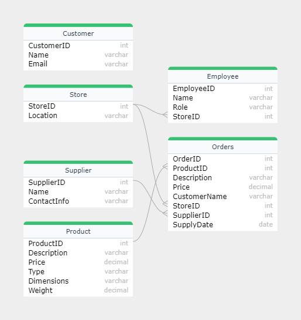
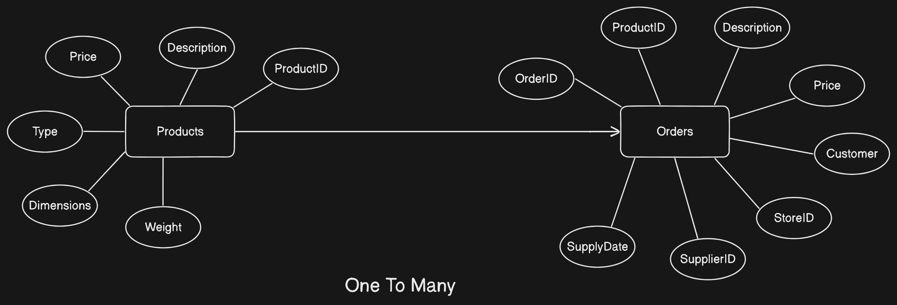
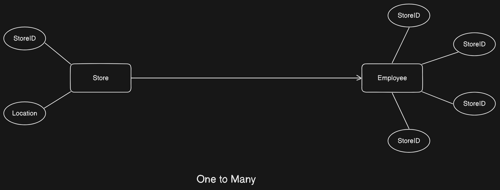
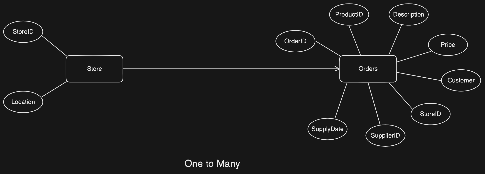
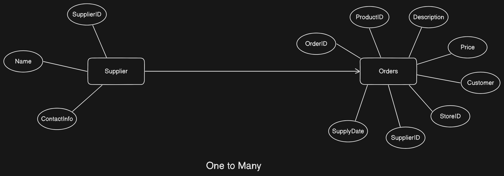

# Inventory Management System

- Part of my Second Year UnderGraduate Course.
- Created a website to manage the inventory and other important data for a furnishing store.
- Implemented CRUD operations to manage and organize data.

## Features

- **Data Management:**
  - The project manages data for the Furnishing company like furniture inventory, employee details, store details, supplier details and order details.
  - The project offers an all in one comprehensive solution for managing the company data effectively and easily.
- **Real Time Data Storage:**

  - The project stores the data in real time and hence always updated, most recent and fresh data is available for the Users too visualize.

- **CRUD Operations:**
  - The project offers CRUD operations for admins to include, create, delete or update data based on their requirements making data storage and manipulation easy.

## Tech Stack Used:

- Frontend
  - PHP (For scripting)
  - HTML & CSS (For styling)
- Backend
  - PHP (For scripting)
  - OracleSQL (To store data)

## ER Diagram

## Relationship Diagrams

### Product Order Relationship

### Store Employee Relationship

### Store Order Relationship

### Supplier Orders Relationship

